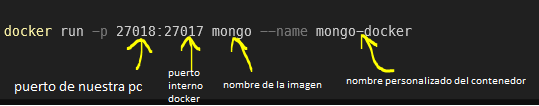

# Docker

ver imagenes descargadas

```docker images```

eliminar una imagen

```docker image rm <IdImage>```

ver contenedores corriendo:

```docker ps```

descargar e instalar imagen de mongo:

```docker pull mongo```

ejecutar contenedor que levante base de datos de mongo utilizando esa imagen:

```docker run -p 27018:27017 mongo --name mongo-docker mongo```



para frenar un contenedor:

```docker stop <IDdelContenedor>```

para eliminar un contenedor:

```docker container rm <IDdelContenedor>```

generar imagen a partir de Dockerfile:

```docker build -t <nombreDeLaImagen> .```

iniciar sesion en docker hub desde terminal:

```docker login```

renombrar imagen para subir a docker hub:

```docker tag <nombreDeLaImagen> <username>/<nombreDeLaImagen>:1.0.0```

```docker push <username>/<nombreDeLaImagen>:1.0.0```

# Docker-compose

para levantar archivo yml renombrado como docker-compose.yml:

```docker compose up -d```

para frenar la ejecucion del contenedor:

```docker compose down```

# Orquestación de contenedores

descargar imagen de minikube y correr contenedor:

```minikube start```

levantar nuestro servidor en el cluster de kubernetes local de minikube:

```kubectl apply -f <nombreDelArchivo>.yml```

corroborar si el deploy se realizó satisfactoriamente:

```kubectl get deployments```

visualizar pods:

```kubectl get pods```

listar servicios de minikube:

```minikube service list```

levantar servicio en localhost:

```minikube service <nombreDelServicio>```